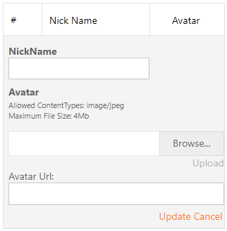

# Grid View for ASP.NET MVC- How to Specify a Custom Edit Form Template

This example demonstrates how to specify a custom EditForm template in the grid, add the Upload control to the template, and edit the in-memory data source.



Set up the grid control, set the [GridView.SettingsEditing.Mode](https://docs.devexpress.com/AspNet/DevExpress.Web.ASPxGridViewEditingSettings.Mode) property to `EditFormAndDisplayRow`, create a templated column, and call the [GridViewSettings.SetEditFormTemplateContent](http://documentation.devexpress.com/#AspNet/DevExpressWebMvcGridViewSettings_SetEditFormTemplateContenttopic) method to define an edit form template.

```xml
@Html.DevExpress().GridView(
    settings => {
        settings.Name = "gridView";
        settings.KeyFieldName = "ID";
        settings.CallbackRouteValues = new { Controller = "Home", Action = "GridViewPartial" };
        settings.SettingsEditing.Mode = GridViewEditingMode.EditFormAndDisplayRow;
            // ...
        settings.SetEditFormTemplateContent( c => {
            // ...
        }
    }
).Bind(Model).GetHtml()
```

Add the Upload control to the edit form template and define its settings. To allow the control to post selected files, wrap it with a form. In the [FileUploadComplete](https://docs.devexpress.com/AspNet/js-ASPxClientUploadControl.FileUploadComplete) event handler, assign the value obtained from the server to the text box editor.

```xml
@Html.DevExpress().GridView(
    settings => {
        // ...
        settings.SetEditFormTemplateContent( c => {
                // ...
                using(Html.BeginForm("ImageUpload", "Home", FormMethod.Post)) {
                    Html.DevExpress().UploadControl(
                        ucSettings => {
                            // ...
                            ucSettings.ClientSideEvents.FileUploadComplete = "function(s, e) { if(e.isValid) { avatarUrl.SetValue(e.callbackData) } }";
                        }
                    ).Render();
                }
                Html.DevExpress().TextBox(
                    edtSettings => {
                        edtSettings.Name = "avatarUrl";
                        edtSettings.Width = System.Web.UI.WebControls.Unit.Percentage(100);
                    }
                )
        }
    }
).Bind(Model).GetHtml()
```

Update the in-memory data source. 


## Files to Look At

* [HomeController.cs](./CS/Sample/Controllers/HomeController.cs) (VB: [HomeController.vb](./VB/Sample/Controllers/HomeController.vb))
* [GridViewPartial.cshtml](./CS/Sample/Views/Home/GridViewPartial.cshtml)
* [Users.cs](./CS/Sample/Models/Users.cs) (VB: [Users.vb](./VB/Sample/Models/Users.vb))

## Documentation

- [GridView.SettingsEditing.Mode](https://docs.devexpress.com/AspNet/DevExpress.Web.ASPxGridViewEditingSettings.Mode)
- [GridViewSettings.SetEditFormTemplateContent](http://documentation.devexpress.com/#AspNet/DevExpressWebMvcGridViewSettings_SetEditFormTemplateContenttopic)
- [FileUploadComplete](https://docs.devexpress.com/AspNet/js-ASPxClientUploadControl.FileUploadComplete)

## More Examples

- [Grid View for MVC - How to Bind a Grid to Standard In-Memory Data Sources (DataTable, List)](https://github.com/DevExpress-Examples/mvc-gridview-bind-to-in-memory-data-sources)
- [Grid View for MVC - How to Edit In-Memory Data Source](https://github.com/DevExpress-Examples/gridview-how-to-edit-in-memory-data-source-e3983)
